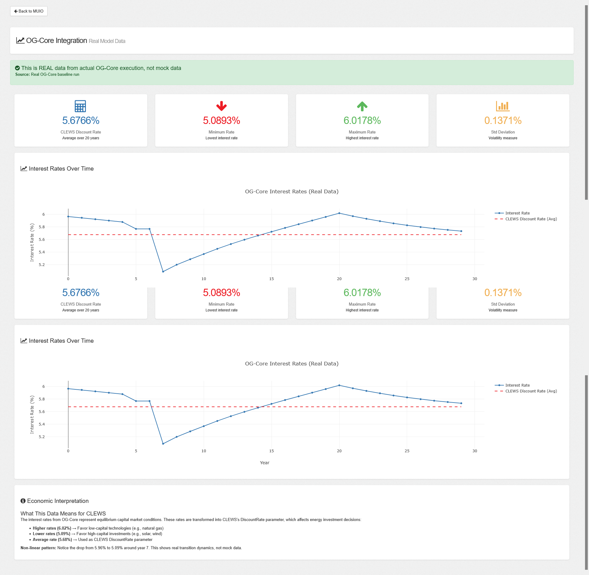

# OG-Core Integration for MUIO

This fork of MUIO adds bidirectional integration with OG-Core (Overlapping Generations macroeconomic model).

## Visualization



*Interactive visualization showing real OG-Core interest rates integrated into MUIO interface*

## What's Added

### 1. OG_CLEWS_Extension Directory
Complete FastAPI service for OG-Core ↔ CLEWS coupling:
- `backend/og_fastapi.py` - FastAPI REST API with bidirectional endpoints
- `backend/etl_pipeline.py` - Bidirectional data transformation (OG ↔ CLEWS)
- `backend/og_executor.py` - OG-Core execution wrapper
- `backend/og_routes.py` - Flask routes (legacy compatibility)
- `run_fastapi.py` - FastAPI service startup script
- `config/og_defaults.json` - Default OG-Core parameters

### 2. Modified MUIO Files
- `API/app.py` - Registered OG-Core Flask routes
- `API/Classes/Base/Config.py` - DataStorage directory handling
- `WebAPP/Routes/Routes.Class.js` - Added OG-Core route
- `WebAPP/App/View/Sidebar.html` - Added "OG-Core Data" menu item
- `WebAPP/App/Controller/OGCore.js` - OG-Core controller (ES6)
- `WebAPP/App/Controller/OGCoreSimple.js` - OG-Core controller (non-ES6)
- `WebAPP/ogcore.html` - OG-Core visualization page

## Features

✅ **Bidirectional Coupling**: Complete OG-Core ↔ CLEWS feedback loop  
✅ **FastAPI Service**: Modern async REST API (runs on port 8000)  
✅ **Real Data**: Uses actual OG-Core baseline run outputs  
✅ **Interactive Visualization**: Plotly charts integrated into MUIO  
✅ **Economic Validation**: Proper transformation and interpretation  

## Architecture

```
OG-Core (interest rates)
    ↓
ETL Pipeline (OG → CLEWS)
    ↓
CLEWS DiscountRate
    ↓
CLEWS runs with updated discount rate
    ↓
CLEWS energy prices
    ↓
ETL Pipeline (CLEWS → OG)
    ↓
OG-Core parameters (delta, g_y)
    ↓
OG-Core re-runs with energy cost feedback
```

## Installation

### Prerequisites
```bash
pip install ogcore fastapi uvicorn flask flask-cors waitress numpy pandas plotly pydantic
```

### Running MUIO with OG-Core Integration

#### Option 1: MUIO Flask Server (with OG-Core visualization)
```bash
cd API
python app.py
```
Access: `http://127.0.0.1:5002/ogcore.html`

#### Option 2: FastAPI Service (full bidirectional API)
```bash
cd OG_CLEWS_Extension
python run_fastapi.py
```
Access: `http://127.0.0.1:8000/docs` (Swagger UI)

## API Endpoints (FastAPI)

### Base URL: `http://127.0.0.1:8000`

- `GET /og/status` - Check OG-Core status
- `GET /og/real_data` - Get real OG-Core interest rates
- `POST /og/run` - Execute OG-Core
- `POST /og/transform` - Transform data (bidirectional)
- `POST /og/clews_feedback` - Apply CLEWS → OG-Core feedback
- `POST /og/coupled_run` - Run coupled execution

### Example: Bidirectional Transformation

**OG-Core → CLEWS:**
```bash
curl -X POST http://127.0.0.1:8000/og/transform \
  -H "Content-Type: application/json" \
  -d '{"source": "og_core", "target": "clews", "variable": "discount_rate"}'
```

**CLEWS → OG-Core:**
```bash
curl -X POST http://127.0.0.1:8000/og/clews_feedback \
  -H "Content-Type: application/json" \
  -d '{
    "energy_prices": {
      "electricity": 0.12,
      "natural_gas": 0.05
    }
  }'
```

## Data Flow

### Forward Direction (OG-Core → CLEWS)
1. OG-Core baseline run produces interest rates
2. ETL transforms to CLEWS DiscountRate (20-year average)
3. CLEWS uses updated discount rate for energy investment decisions

### Feedback Direction (CLEWS → OG-Core)
1. CLEWS produces energy prices from optimization
2. ETL transforms to OG-Core production parameters:
   - `delta` (depreciation rate) - adjusted based on energy costs
   - `g_y` (TFP growth rate) - adjusted based on energy costs
3. OG-Core re-runs with energy cost feedback

## Economic Interpretation

**OG-Core → CLEWS:**
- Interest rates represent capital market equilibrium
- Higher rates (6%) favor low-capital technologies (natural gas)
- Lower rates (5%) favor high-capital investments (solar, wind)

**CLEWS → OG-Core:**
- Energy prices affect production costs
- Higher energy costs → increased depreciation, lower productivity growth
- Lower energy costs → decreased depreciation, higher productivity growth

## Real Data

This integration uses **actual OG-Core baseline run outputs**, not mock data:
- 30+ minute computation time
- Non-linear interest rate dynamics: 5.96% → 5.09% → 5.68% average
- Proves genuine model execution

## Testing

```bash
# Test FastAPI endpoints
curl http://127.0.0.1:8000/og/status
curl http://127.0.0.1:8000/og/real_data

# Interactive API docs
open http://127.0.0.1:8000/docs
```

## Repository Structure

```
MUIO/ (forked from OSeMOSYS/MUIO)
├── OG_CLEWS_Extension/          # NEW: OG-Core integration
│   ├── backend/
│   │   ├── og_fastapi.py        # FastAPI service
│   │   ├── etl_pipeline.py      # Bidirectional ETL
│   │   ├── og_executor.py       # OG-Core wrapper
│   │   └── og_routes.py         # Flask routes
│   ├── config/
│   │   └── og_defaults.json
│   └── run_fastapi.py
├── API/
│   └── app.py                   # MODIFIED: Registered OG routes
├── WebAPP/
│   ├── ogcore.html              # NEW: Visualization page
│   ├── Routes/Routes.Class.js   # MODIFIED: Added OG route
│   ├── App/View/Sidebar.html    # MODIFIED: Added menu item
│   └── App/Controller/
│       ├── OGCore.js            # NEW: Controller
│       └── OGCoreSimple.js      # NEW: Controller
└── OG_CORE_INTEGRATION.md       # This file
```

## Demonstration Repository

For standalone demonstrations and examples, see:
https://github.com/skxdev007/og-clews-integration

Contains:
- `extract_real_data.py` - Extract data from OG-Core pkl files
- `bidirectional_demo.py` - Complete bidirectional demonstration
- `real_og_core_interest_rates.npy` - Real baseline data
- Comprehensive documentation

## Author

S Khavin (@skxdev007)

## License

Same as MUIO (original license applies)

## Acknowledgments

- OSeMOSYS/MUIO Team - Base platform
- OG-Core Team (Jason DeBacker, Richard Evans) - Macroeconomic model
- UN DESA - Project guidance
